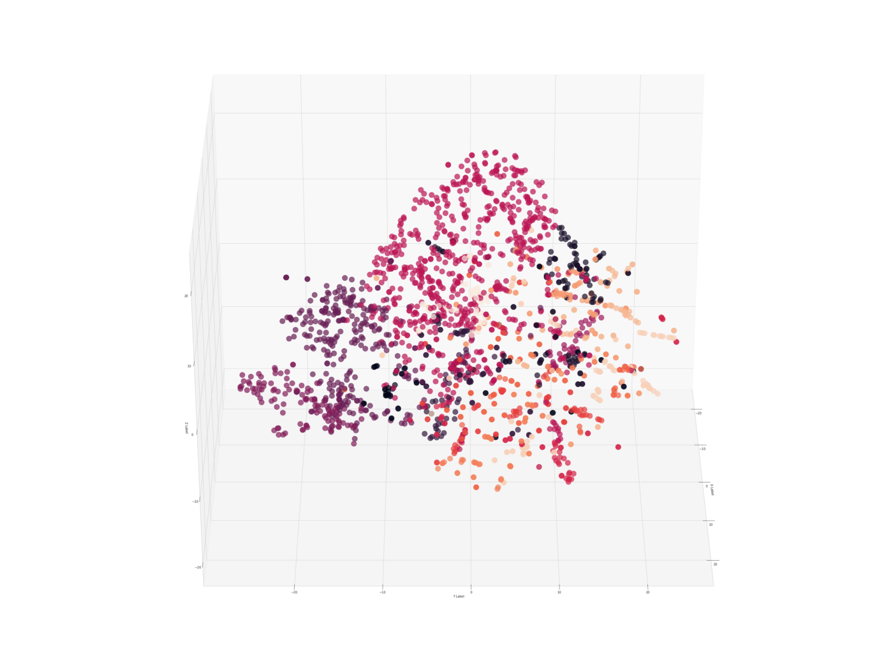
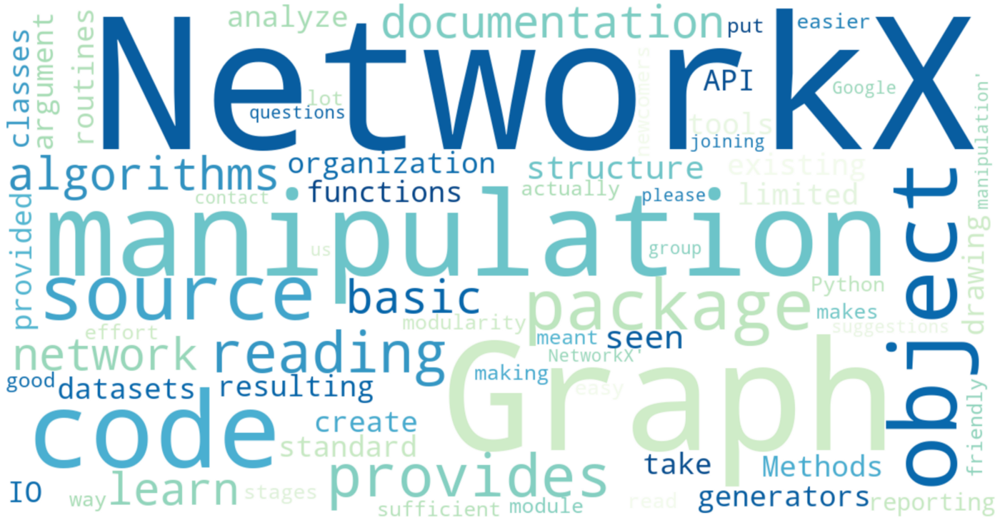

# Jinhang Jiang  
*Student Researcher at ASU Actionable Analytics Lab*
###  [LinkedIn Profile](https://www.linkedin.com/in/jinhangjiang/)
###  [Medium Profile](https://medium.com/@jinhangjiang)
###  [Stackoverflow Profile](https://stackoverflow.com/users/13609600/jinhang-jiang?tab=profile)
###  [Toutiaohao Profile](https://m.toutiao.com/is/JuMPtA6/)
###  [Kaggle Profile](https://www.kaggle.com/jinhangjiang)

# Featured Work
## [Visualize High-Dimensional Network Data with 3D 360-Degree-Animated Scatter Plot](https://towardsdatascience.com/visualize-high-dimensional-network-data-with-3d-360-degree-animated-scatter-plot-d583932d3693)
Author: Jinhang Jiang   
Published on: towardsdatascience.com  
Date: June 25, 2021  
Description: Use node2vec, networkx, pca, seaborn, etc. to visualize high-dimensional network data.

 
## [NetworkX: Code Demo for Manipulating Subgraphs](https://towardsdatascience.com/networkx-code-demo-for-manipulating-subgraphs-e45320581d13)
Author: Jinhang Jiang   
Published on: towardsdatascience.com  
Date: June 6, 2021  
Description: Code demo for manipulating egonetworks using NetworkX in python.

 
## [Customer Churn Accuracy: Increased 4.6% With TextBlob & SBERT](https://towardsdatascience.com/customer-churn-accuracy-a-4-6-increase-with-feature-engineering-29bcb1b1ee8f)
Author: Jinhang Jiang   
Published on: towardsdatascience.com  
Date: May 10, 2021  
Location: Arizona State University | *Tempe, AZ*  
Description: A walk-through about how I increased 4.6% accuracy on a small customer churn dataset with the customer service notes.

 
## [LOL Match Prediction Using Early Laning Phase Data | Machine Learning](https://towardsdatascience.com/lol-match-prediction-using-early-laning-phase-data-machine-learning-4c13c12852fa)
Author: Jinhang Jiang   
Published on: towardsdatascience.com  
Date: Nov 11, 2020  
Location: Arizona State University | *Tempe, AZ*  
Description: Used the first 10 mins data from approximately 10K games to predict the results in high-ELO rank games.

 
## [Analyzing Disease Co-occurrence Using NetworkX, Gephi, and Node2Vec](https://medium.com/analytics-vidhya/analyzing-disease-co-occurrence-using-networkx-gephi-and-node2vec-53941da35a0f)
Author: Jinhang Jiang  | Instructor: Dr.[Karthik Srinivasan](https://business.ku.edu/karthik-srinivasan)  
Published on: Analytics Vidhya's Medium Publication  
Date: May 4, 2020  
Location: The University of Kansas | *Lawrence, KS*  
Description: I analyzed over 200 million EHR to build a network model, predicting diseases for high-cost patients at POA.

 
## [Simple Weighted Average Ensemble | Machine Learning](https://medium.com/@jinhangjiang/simple-weighted-average-ensemble-machine-learning-777824852426)
Author: Jinhang Jiang    
Published on: Analytics Vidhya's Medium Publication  
Date: Oct 13, 2020  
Location: Arizona State University | *Tempe, AZ*  
Description: This is a walk-through about how to apply the weighted average ensemble to improve your prediction scores.

 
## [Use R to Calculate Boilerplate for Accounting Analysis](https://medium.com/@jinhangjiang/use-r-to-calculate-boilerplate-for-accounting-analysis-f4a5b64e9b0d)
Author: Jinhang Jiang  | Instructor: Dr.[Karthik Srinivasan](https://business.ku.edu/karthik-srinivasan)  
Published on: Towards Data Science | medium.com  
Date: May 19, 2020  
Location: The University of Kansas | *Lawrence, KS*  
Description: I calculated Boilerplate score for 1431 companies' scoial responsibility reports. Here is a demonstration.

