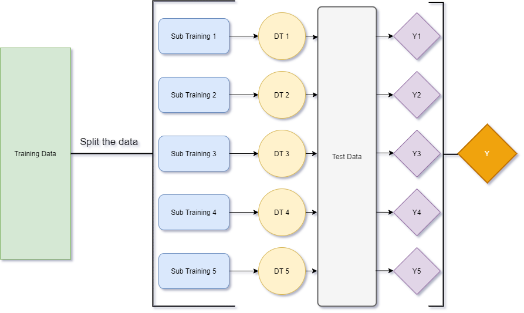

# Jinhang Jiang  
*MS Business Analytics Candidate at ASU W.P Carey 21'*
###  [LinkedIn Profile](https://www.linkedin.com/in/jinhangjiang/)
###  [Medium Profile](https://medium.com/@jinhangjiang)
###  [Stackoverflow Profile](https://stackoverflow.com/users/13609600/jinhang-jiang?tab=profile)
###  [Kaggle Profile](https://www.kaggle.com/jinhangjiang)

# Featured Work
 
## [Analyzing Disease Co-occurrence Using NetworkX, Gephi, and Node2Vec](https://medium.com/analytics-vidhya/analyzing-disease-co-occurrence-using-networkx-gephi-and-node2vec-53941da35a0f)
Author: Jinhang Jiang  | Instructor: Dr.[Karthik Srinivasan](https://business.ku.edu/karthik-srinivasan)  
Published on: Analytics Vidhya's Medium Publication  
Date: May 4, 2020  
Location: The University of Kansas | *Lawrence, KS*  
Description: I analyzed over 200 million EHR to build a network model, predicting diseases for high-cost patients at POA.

 
## [Incorporate Text Feature Into Classification Project](https://jinhangjiang.medium.com/integrate-text-content-into-classification-project-eddd8e18a7e9)
Author: Jinhang Jiang   
Published on: Medium.com  
Date: Oct 31, 2020  
Location: Arizona State University | *Tempe, AZ*  
Description: This project aimed to study how the unstructured text data could add values to a machine learning classification project.

 
## [Simple Weighted Average Ensemble | Machine Learning](https://medium.com/@jinhangjiang/simple-weighted-average-ensemble-machine-learning-777824852426)
Author: Jinhang Jiang    
Published on: Analytics Vidhya's Medium Publication  
Date: Oct 13, 2020  
Location: Arizona State University | *Tempe, AZ*  
Description: This is a walk-through about how to apply the weighted average ensemble to improve your prediction scores..

 
## [Use R to Calculate Boilerplate for Accounting Analysis](https://medium.com/@jinhangjiang/use-r-to-calculate-boilerplate-for-accounting-analysis-f4a5b64e9b0d)
Author: Jinhang Jiang  | Instructor: Dr.[Karthik Srinivasan](https://business.ku.edu/karthik-srinivasan)  
Published on: Towards Data Science | medium.com  
Date: May 19, 2020  
Location: The University of Kansas | *Lawrence, KS*  
Description: I calculated Boilerplate score for 1431 companies' scoial responsibility reports. Here is a demonstration.

